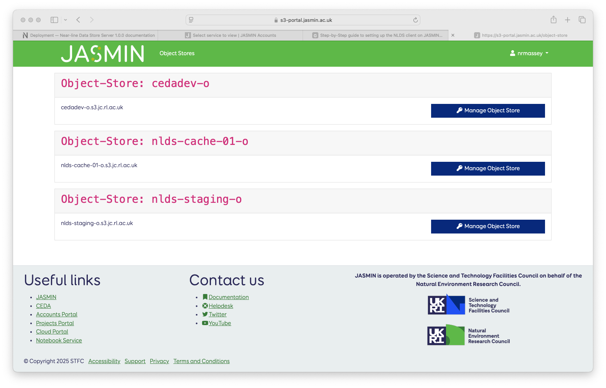

Step-by-Step guide to setting up the NLDS client on JASMIN
==========================================================

Setting up the NLDS client on JASMIN, so that users can access NLDS, is a multi-step process, using a number of access portals.  This guide will take you through the process step-by-step.

To use the NLDS, you, as a JASMIN user, will require the following:

1. A JASMIN user account.
2. Access to the Group Workspace that holds the files you wish to put into the NLDS.
3. Access to the Object Store for the NLDS tenancy, including generated access keys.
4. An installed and configured NLDS client.

The following sections will deal with each of these in turn.

.. _user_account:

Getting a JASMIN user account
-----------------------------

This is covered extensively in the "Getting Started" section of the JASMIN help docs:
`JASMIN : Docs : Getting Started <https://help.jasmin.ac.uk/docs/getting-started/>`_.

.. _gws_access:

Getting access to a Group Workspace
-----------------------------------

Before proceeding, please read the JASMIN introduction to Group Workspaces:
`JASMIN : Docs : What is a Group Workspace? <https://help.jasmin.ac.uk/docs/short-term-project-storage/introduction-to-group-workspaces/>`_

Once you have access to JASMIN, you will need to apply for access to the Group Workspace (GWS) that you wish to put files into the NLDS from, and also as a location to retrieve files from the NLDS to.
This is done via the JASMIN accounts portal:

1. Log into the JASMIN accounts portal: `accounts.jasmin.ac.uk <https://accounts.jasmin.ac.uk>`_
2. Click ``My JASMIN account``.  You should see this screen:
   

3. Click on ``My services`` then ``Group Workspaces`` on the next screen, in the left-hand gray column.  You will see this screen:

.. image:: ./_images/gws.png
    :width: 50 %
    :align: center

4. Search for the Group Workspace in the search bar, and then click ``More Information`` for the GWS you wish to join.

5. Click ``Apply for Access``, fill out the form and click ``Apply``.  This will make a request to the GWS Manager, who will answer your request and either confirm or deny your access to the GWS.  You need to await an email detailing the outcome of this decision before proceeding to the next step.

.. _object_store_access:

Access to the Object Store
--------------------------

Before proceeding, please read the JASMIN help documentation on the Object Store:
`JASMIN : Docs : Object Store <https://help.jasmin.ac.uk/docs/short-term-project-storage/using-the-jasmin-object-store/>`_.

You will require access to the Object Store that is used by NLDS to store files before they are put to tape, and after they are retrieved from tape.  To gain access two keys are required: the ``access key`` and the ``secret key``.  These are obtained by interacting with the Object Store portal but, before that, you must apply for access to the NLDS tenancy on the Object Store.  A tenancy is the name of an allocated area of space on the Object Store.

1. Follow steps ``1`` & ``2`` in :ref:`gws_access`.
2. Click on ``My services`` and click on ``Object Store`` in the left-hand gray column.  You will see this screen:

.. image:: ./_images/obj_store.png
    :width: 50 %
    :align: center

3. Search for the tenancy ``nlds-cache-01-o``.  Click ``More information``, then ``Apply``.  This will make a request to the JASMIN team, who will inform you of their decision.  You need to await the outcome of this decision before proceeding to the next step.

.. note::
    If you are taking part in the NLDS beta testing program, then you will have to apply for the tenancy ``nlds-staging-o``.  In subsequent instructions, replace ``nlds-cache-01-o`` with ``nlds-staging-o``.  Once the beta test has concluded, you will be able to create your access to the ``nlds-cache-01-o`` Object Storage, and edit your configuration files to reflect this.

4. Log into the `JASMIN Object Store portal <https://s3-portal.jasmin.ac.uk>`_ using your web-browser.  Use your regular JASMIN account username and password.
5. Click on the ``Object Stores`` blue button.  You will be presented with a list of your Object Store tenancies.  

6. Click on the ``Manage Object Store`` blue button for the ``nlds-cache-01-o`` tenancy.  You may have to re-enter your JASMIN accounts password.

You will be presented with this screen:

Click on the ``Create Key`` tab at the top of the table.

7. Fill in the Description and an expiry-date and click ``Create Access Key``.

8. You will be presented with a pop-up declaring **Successfully created Secret and Access Keys**.  Carefully copy the ``Access Key`` and the ``S3 Secret Key`` and store them somewhere safe, preferably in a password manager.  **Heed the warning** - you will not be able to see the ``S3 Secret Key`` again.

.. note::
    If you are taking part in the NLDS beta testing program, then you will have to create keys for the ``nlds-staging-o`` tenancy. Once the beta test has concluded, you will be able to create keys for the ``nlds-cache-01-o`` tenancy, and edit your configuration files to reflect this.

You now have access to the Object Store tenancy for NLDS, and have generated a pair of keys that will allow you to access it from the NLDS client.

.. _installing_nlds_client:

Installing the NLDS client on a JASMIN scientific analysis server
-----------------------------------------------------------------

First, please familiarise yourself with the JASMIN documentation on the scientific analysis servers: `JASMIN : Docs : Scientific analysis servers <https://help.jasmin.ac.uk/docs/interactive-computing/sci-servers/>`_
We suggest that you use one of the ``sci-vm-0x`` servers to set up and use the NLDS client.  An alternative is to use the JASMIN transfer servers, if it suits your workflow more.  Details of these are here: `JASMIN : Docs : Transfer servers <https://help.jasmin.ac.uk/docs/interactive-computing/transfer-servers/>`.  Creating the virtual-evironment in your home directory means that it is available from both the scientific analysis servers or the transfer servers.

1.  Log into your chosen scientific analysis server:

.. code-block:: bash
    
    > ssh <username>@sci-vm-01.jasmin.ac.uk

2. Follow the installation instructions here: :ref:`NLDS : Docs : Installation<installation>`.  The steps are reproduced below:

.. code-block:: bash

    > python3 -m venv ~/nlds-client
    > source ~/nlds-client/bin/activate
    > pip install --upgrade pip
    > pip install git+https://github.com/cedadev/nlds-client.git

.. note::
   The installation procedure for the NLDS client will likely change when NLDS is in full production.  You may have to reinstall your client.

.. _configuring_nlds_client:

Configuring the NLDS client
---------------------------

1.  First make sure your are running the ``nlds-client`` virtual-environment that you created above.  If you are not running it then issue the command:

.. code-block:: bash

    > source ~/nlds-client/bin/activate

2.  Run NLDS with the init command to create your NLDS config file.  This file will be in your home directory with the name ``.nlds-config``.  The full path is ``~/.nlds-config``, also ``$HOME/.nlds-config``.

.. code-block:: bash

    > nlds init

This produces the output:

.. code-block:: text

    Initialising the Near-line Data Store...

    Successfully initialised, the config file at ~/.nlds-config has been updated with some of the necessary information to start using the NLDS.

    You may still need to manually update the fields:
    - user.default_user 
    - user.default_group 
    - object_storage.access_key
    - object_storage.secret_key
    - object_storage.tenancy (will default to nlds-cache-02 if not set)

    The latter three values can be obtained from the object store portal for any object stores you have access to (https://s3-portal.jasmin.ac.uk/).

.. note::

    If you are taking part in the NLDS beta testing program, you will also need to specify a URL with the ``-u`` switch and turn off SSL verification with the ``-k`` flag, so your init command will look a bit like this:

    .. code-block:: bash

        > nlds init -u {{ nlds-testing-url }} -k
            
    but with the ``{{ nlds-testing-url }}`` replaced with the URL provided to you by in the invitation email.

3.  Edit the file at ``~/.nlds-config`` to add some extra information.  The file looks like this:

.. code-block:: json

    {
        "server": {
            "url": "https://nlds.jasmin.ac.uk",
            "api": "api/0.1"
        },
        "user": {
            "default_user": "{{ user }}",
            "default_group": "{{ group }}"
        },
        "authentication": {
            "oauth_client_id": "<redacted>",
            "oauth_client_secret": "<redacted>",
            "oauth_token_url": "<redacted>",
            "oauth_scopes": "<redacted>",
            "oauth_token_file_location": "~/.nlds-token"
        },
        "object_storage": {
            "access_key": "{{ os_access_key }}",
            "secret_key": "{{ os_secret_key }}"
        },
        "options": {
            "verify_certificates": true
        }
    }

The fields marked ``<redacted>`` will have values in your file, we have removed them from this document for security reasons.  The information you need to add is the values for ``default_user``, ``default_group``, ``access_key`` and ``secret_key``.

    * ``default_user`` : replace ``{{ user }}`` with your JASMIN username.  This can be overriden by using the ``-u`` command line option with the ``nlds`` client.
    * ``default_group`` : replace ``{{ group }}`` with the name of the Group Workspace you will be using most often.  This can be overriden by using the ``-g`` option with the ``nlds`` client.  This is the name as it appears in the path of the Group Workspace.  **It does not include the ``gws_``** part.
    * ``access_key`` : replace ``{{ os_access_key }}`` with the value of ``Access Key`` you created in step 8 of :ref:`Access to the Object Store<object_store_access>`.
    * ``secret_key`` : replace ``{{ os_secret_key }}`` with the value of ``S3 Secret Key`` you created in step 8 of :ref:`Access to the Object Store<object_store_access>`.

.. note::
    If you are taking part in the NLDS beta testing program, then you will have to add an extra line in the ``user`` part of the config.  This is for the ``tenancy``, which should be set to ``nlds-staging-o.s3.jc.rl.ac.uk``.  i.e.:

    .. code-block:: json

        "user": {
            "default_user": "{{ user }}",
            "default_group": "{{ group }}",
            "tenancy": "nlds-staging-o.jc.rl.ac.uk"
        },

    (Don't forget the extra comma after ``group``!)

    You also need to change the ``verify_certificates`` option to ``false``:

    .. code-block:: json

        "options": {
            "verify_certificates": false
        }

Running the NLDS client for the first time
------------------------------------------

You should now have a fully configured and functioning NLDS client.  You can now run the NLDS client for the first time.  Make sure the Python virtual-environment you created in :ref:`Installing the NLDS client<installing_nlds_client>` is activated first, and then run ``nlds`` with the command ``stat``.

.. code-block:: bash

    > source ~/nlds-client/bin/activate
    > nlds stat

You will see the following output:

.. code-block:: text

    This application uses OAuth2 to authenticate with the server on your behalf.
    To do this it needs your username and password.
    Your password is not stored.  It is used to obtain an access token, which is stored in the file: ~/.nlds-token
    Username:
    Password:

Fill in your JASMIN username and password.  This will now create the file at ``~/.nlds-token``.  You can examine this file using a text editor.  Note that the contents of this file will change every 24 hours or so, as the token is refreshed.

Because you issued the ``stat`` command with ``nlds``, the status of all your NLDS requests will be shown.  This should be empty, as this is the first time you have run NLDS.

Next steps
----------

Now that you have the NLDS client set up on JASMIN, you can go through the tutorial: :ref:`NLDS : Docs : Tutorial <tutorial>`.  Because you have worked through this guide, you can skip the first 3 sections, and start at :ref:`NLDS : Docs : Catalog <catalog>`.