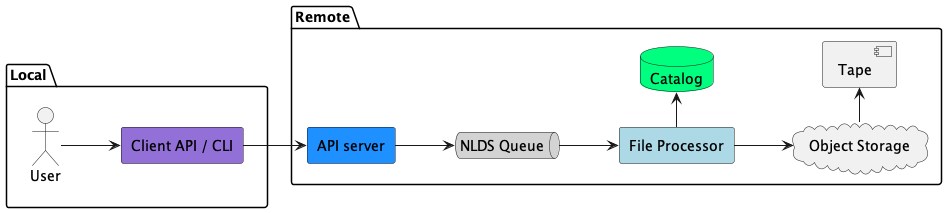
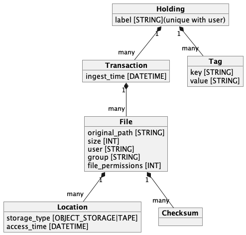

Tutorial
========

This page is a tutorial on NLDS covering:

* :ref:`Introduction to the NLDS <intro>`
* :ref:`Setting up the NLDS client <client>`
* :ref:`Running the NLDS client for the first time <first>`
* :ref:`How the NLDS data catalog is organised <catalog>`
* :ref:`Copying a single file (PUT) to the NLDS <put>`
* :ref:`Copying a list of files (PUTLIST) to the NLDS <putlist>`
* :ref:`Querying the status of a transaction (STAT) <stat>`
* :ref:`Querying the file collection the user holds on the NLDS (LIST) <list>`
* :ref:`Querying the files the user holds on the NLDS (FIND) <find>`
* :ref:`Changing the label of a file collection (META) <label>`
* :ref:`Adding tags to a file collection (META) <tags>`
* :ref:`Searching for files based on the file collection label <search_label>`
* :ref:`Searching for files based on the file collection tags <search_tags>`

.. _intro:

Introduction to the NLDS
--------------------------------------------------------------

The Near-Line Data Store (NLDS) is a multi-tiered storage solution that uses 
Object Storage as a front end to a tape library.  Interaction with NLDS is via 
a HTTP API, with a Python library and command-line client provided to users for 
programmatic or interactive use.  

When a user transfers files to the NLDS, the files are first written to the 
Object Storage, and a backup is made to tape.  
When the Object Storage is approaching capacity, a set of policies is 
interrogated to determine which files will be removed from the Object Storage.  
When a user retrieves a file, the NLDS may have to first transfer the file from 
tape to the Object Storage, if it has been deleted by the policies.  This in 
effect creates a multitier of hot (disk), warm (Object Storage) and cold (Tape) 
storage, with a common interface to all.

The NLDS also provides a searchable catalog of files, with the user able to
assign a label and tags to a collection of files.

    Figure 1: User view of the Near-Line Data Store

.. _client:

Setting up the NLDS client
--------------------------------------------------------------

Before using the NLDS, a user must install and set-up the NLDS client.  For the
NLDS installation on JASMIN, the user must also:

#. Have access to the Object Storage tenancy they wish to write files to
#. Be a member of the GroupWorkspace they wish to use for writing to tape
#. Have access to a GroupWorkspace to read and write files to

The NLDS client is a command-line program with the name `nlds`.
To install this, refer to the page :ref:`installation<Installation>`.

The ``nlds`` client program relies on a configuration file stored in the user's
home directory with the path ``~/.nlds-config``.  This contains information
needed to connect the client to the NLDS server.  For more information, refer
to the page :ref:`configuration<Configuration>`.

On JASMIN, the ``user_name`` and ``user_gws`` fields can be filled in by the
user.  However, all of the fields in the ``server`` section of the file, and the
``authentication`` section will need to be provided by the JASMIN system 
adminstrators.  Fields in the ``object_storage`` section will need to match
those generated by the Object Storage portal on JASMIN.
Users can freely change the value of the ``oauth_token_file_location`` field in
the ``authentication`` section.

.. _first:

Running the NLDS client for the first time
--------------------------------------------------------------

Once the NLDS client is successfully installed, the user can run it.  On JASMIN,
the first time ``nlds`` is run, the user will be asked for their user name and
password.  These are the JASMIN **user name** and **password**, which the user
usually uses to login into JASMIN via the ``loginx.jasmin.ac.uk`` servers.

The following message is displayed:

.. code-block:: text

    This application uses OAuth2 to authenticate with the server on your behalf.
    To do this it needs your username and password.
    Your password is not stored.  It is used to obtain an access token, which is stored in the file: ~/.nlds-token
    Username:
    Password:

After entering your JASMIN user name and password, the OAuth2 token is created
at the path pointed to by ``oauth_token_file_location`` in the ``~/.nlds-config``
file.  The NLDS authorisation system uses refresh tokens to fetch a new token
when the current one has expired

.. _catalog:

How the NLDS data catalog is organised
--------------------------------------------------------------

When a user PUTs files into the NLDS, a record of those files is kept in a data
catalog.  This organises the files into *Holdings*, *Transactions* and *Files*,
with the ability to add metadata to the *Holdings* in the form of *Tags* and
*Labels*.

Figure 2 shows a simplified view of the NLDS data-catalog.  This is covered in
much more depth in the :ref:`catalog_organisation` section.

    Figure 2: Simplified view of the NLDS data-catalog

.. _put:

Copying a single file (PUT) to the NLDS
--------------------------------------------------------------

.. _putlist:

Copying a list of files (PUTLIST) to the NLDS
--------------------------------------------------------------

.. _stat:

Querying the status of a transaction (STAT)
--------------------------------------------------------------

.. _list:

Querying the file collection the user holds on the NLDS (LIST)
--------------------------------------------------------------

.. _find:

Querying the files the user holds on the NLDS (FIND)
--------------------------------------------------------------

.. _label:

Changing the label of a file collection (META)
--------------------------------------------------------------

.. _tags:

Adding tags to a file collection (META)
--------------------------------------------------------------

.. _search_label:

Searching for files based on the file collection label
--------------------------------------------------------------

.. _search_tags:

Searching for files based on the file collection tags
--------------------------------------------------------------