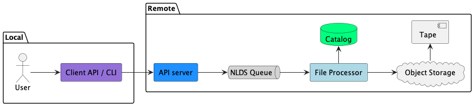
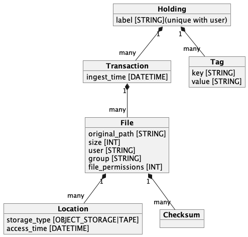

.. _tutorial:

.. |br| raw:: html

   

Tutorial
========

This page is a tutorial on NLDS covering:

* :ref:`Introduction to the NLDS <intro>`
* :ref:`Prerequisites <prereq>`
* :ref:`How the NLDS data catalog is organised <catalog>`
* :ref:`Getting help on the NLDS commands <help>`
* :ref:`Copying a single file (PUT) to the NLDS <put>`
* :ref:`Copying a list of files (PUTLIST) to the NLDS <putlist>`
* :ref:`Querying the status of a transaction (STAT) <stat>`
* :ref:`Querying the file collections the user holds on the NLDS (LIST) <list>`
* :ref:`Querying the files the user holds on the NLDS (FIND) <find>`
* :ref:`Changing the label of a file collection (META) <label>`
* :ref:`Adding tags to a file collection (META) <tags>`

.. _intro:

Introduction to the NLDS
------------------------

The Near-Line Data Store (NLDS) is a multi-tiered storage solution that uses 
object storage as a front-end cache to a tape library.  Interaction with NLDS is via 
a HTTP API, with a Python library and command-line client provided to users for 
programmatic or interactive use.  

When a user ingests files to the NLDS, the files are first written to the 
cache, and a backup is made to tape. When the cache is approaching capacity, a 
set of policies is interrogated to determine which files will be removed from 
the cache. When a user retrieves a file, the NLDS may have to first transfer the file 
from tape to the cache, if it has been deleted by the policies. This, in effect, 
creates a multi-tiered system of hot (disk), warm (cache) and cold (Tape) 
storage, with a common interface to all. Additionally, and more importantly, it 
takes the decision of storage location out of the user's hands; the user only 
needs to interact with the service itself rather than manually specifying the 
movement of data between disk, cache, and tape. 

The NLDS also provides a searchable catalog of files, with the user able to
assign a label and tags to a collection of files.

    Figure 1: User view of the Near-Line Data Store

.. _prereq:

Prerequisites
--------------------------------------------------------------

This tutorial assumes that the user has:

#. A JASMIN user account.  This is covered extensively in the "Getting Started" section of the JASMIN help docs:|br| `JASMIN : Docs : Getting Started <https://help.jasmin.ac.uk/docs/getting-started/>`_
#. Access to a Group Workspace.  This is covered in the JASMIN docs:|br| `JASMIN : Docs : What is a Group Workspace? <https://help.jasmin.ac.uk/docs/short-term-project-storage/introduction-to-group-workspaces/>`_ |br| and |br| `JASMIN : Docs : Apply for access to a GWS <https://help.jasmin.ac.uk/docs/short-term-project-storage/apply-for-access-to-a-gws/>`_
#. An installed and fully configured NLDS client.  This is covered in the :ref:`NLDS : Docs : Step-by-Step guide to setting up the NLDS client on JASMIN <step_by_step>`

.. _catalog:

How the NLDS data catalog is organised
--------------------------------------------------------------

When a user ingests files into the NLDS, a record of those files is kept in a data
catalog.  This organises the files into *Holdings*, *Transactions* and *Files*,
with the ability to add metadata to the *Holdings* in the form of *Tags* and
*Labels*.

Figure 2 shows a simplified view of the NLDS data-catalog.  This is covered in
much more depth in the :ref:`NLDS : Docs : Catalog Organisation <catalog_organisation>` section.

    Figure 2: Simplified view of the NLDS data-catalog

.. _help:

Getting help on the NLDS commands
--------------------------------------------------------------

The ``--help`` option can be used in conjunction with any command to get help
on that specific command.  To get a list of commands, just use ``nlds --help``.

.. code-block:: text

    > nlds --help
    
    Usage: nlds [OPTIONS] COMMAND [ARGS]...

    Options:
    -v, --version  Output NLDS client version and exit.
    --help         Show this message and exit.

    Commands:
    find     Find and list files.
    get      Get a single file.
    getlist  Get a number of files specified in a list.
    init     Set up the NLDS client on first use.
    list     List holdings.
    meta     Alter metadata for a holding.
    put      Put a single file.
    putlist  Put a number of files specified in a list.
    stat     List transactions.

To get help on a specific command, use ``nlds <command> --help``.

.. code-block:: text

    > nlds find --help

    Usage: nlds find [OPTIONS]

    Find and list files. If no user or group is given then these values will
    default to the user:default_user and user:default values in the ~/.nlds-
    config file.

    Options:
    -u, --user TEXT                 The username to find files for.
    -g, --group TEXT                The group to find files for.
    -A, --groupall                  Find files that belong to a group, rather
                                    than a single user
    -l, --label TEXT                The label of the holding which the files
                                    belong to.  This can be a regular expression
                                    (regex) if the -x/--regex flag is also used.
    -i, --holding_id INTEGER        The numeric id of the holding which the
                                    files belong to.
    -n, --transaction_id TEXT       The UUID transaction id of the transaction
                                    to list.
    -p, --path TEXT                 The path of the files to find.  This can be
                                    a regular expression (regex) if the
                                    -x/--regex flag is also used.
    -t, --tag TAG                   The tag(s) of the holding(s) to find files
                                    within.
    -j, --json                      Output the result as JSON.
    -1, --simple                    Output the list of files, one per line,
                                    filepath only.
    -U, --url                       Output the URL for the file on the object
                                    storage.
    -x, --regex                     Use regular expressions in the path and
                                    label search terms.
    -L, --limit INTEGER             Limit the number of files to list.  Default
                                    is 1000 files.
    -9, --descending / -0, --ascending
                                    Switch between ascending and descending time
                                    order.
    --help                          Show this message and exit.

.. _put:

Copying a single file (PUT) to the NLDS
--------------------------------------------------------------

Ingesting data into NLDS is acheived using two commands: ``put`` and ``putlist``.  To put a single file into the NLDS use the command:

``> nlds put <filepath>``

This is the simplest form of the command and will PUT the file into a holding
with a seemingly random label.  It will also use the values of ``user`` and
``group`` from the :ref:`NLDS : Docs : Configuration <configuration>`..

To specify the ``user`` and ``group``:

``> nlds put -u <name> -g <group> <filepath>``

To give the newly created holding a sensible label:

``> nlds put -l <label> <filepath>``

(``-u`` and ``-g`` can also be used at the same time as ``-l``).

To add tags to the holding while PUTting a file to the NLDS:

``> nlds put -l <label> -t <key:value> <filepath>``

(``-l`` is optional here).

To specify a job label use ``-b <job_label>``.  This is a convenience function 
for the user to allow them to group multiple transactions under a single 
``job_label``.

To get the return output from the ``put`` command in JSON format, specify the
``-j`` option.

When a command is invoked, NLDS will return a summary of the command, including
the ``transaction_id``.

.. code-block:: text

    > nlds put -l SheepPen /Users/frjohn/sheep.txt -u frjohn -g farmers -b SheepHerding -t sheepdog:skye
    PUT transaction accepted for processing.
        user            : frjohn
        group           : farmers
        action          : put
        job label       : SheepHerding
        transaction id  : c31abca8-2bc4-43dc-ac64-7d28359d6828
        label           : SheepPen
        tags            : sheepdog : skye

.. note::

    On JASMIN, NLDS cannot transfer data from the user's home directory (``$HOME`` or ``~/``), as only the user has permission to read or write to their own home directory.  NLDS can be used with a Group Workspace (GWS), and with the transfer cache (XFC).

    In a GWS, before you run ``nlds put``, make sure that all the files you want to put into a holding belong to your ``gws_<mygws>`` group using ``chgrp``. In addition, run ``chmod g+r`` for files and ``chmod g+rx`` for directories so NLDS can retrieve them.

.. _putlist:

Copying a list of files (PUTLIST) to the NLDS
--------------------------------------------------------------

To PUT more than one file into the NLDS, use the ``putlist`` command.  This 
takes the same options as the ``put`` command but, rather than taking the path
of a single file as an argument, it takes the name of a plain text file which
contains the paths of the files to PUT into the NLDS.  This *filelist* file must
be in plain text format, with the path of a single file per line, for example:

.. code-block:: text
    
    /Users/frjohn/albatross.txt
    /Users/frjohn/rabbit.txt

The command and response then becomes (where ``test_putlist`` is the name of the 
above file):

.. code-block:: text

    > nlds putlist -l Zoo test_list -u frjohn -g farmers -b test_putlist -t zoo:Bristol
    PUT transaction accepted for processing.
        user            : frjohn
        group           : farmers
        action          : put
        job label       : test_putlist
        transaction id  : 41d412e2-1c1b-4d59-943a-40d9e717a0a1
        label           : Zoo
        tags            : zoo : Bristol

.. _stat:

Querying the status of a transaction (STAT)
--------------------------------------------------------------

The ``put`` and ``putlist`` commands above create transactions.  These are
actions in the NLDS that carry out a specific task, usually either a ``put``,
``putlist``, ``get`` or ``getlist`` command.  To view the status of a 
transaction, use the ``stat`` command.  Invoke the ``stat`` command on its
own to view the state of all the transactions for a user:

.. code-block:: text

    > nlds stat
    State of transactions for user:frjohn, group:farmers
        user        id    action          job label       label           done  state                  last update         
        frjohn      1     put             SheepHerding    SheepPen        100%  COMPLETE               2023-04-18 15:21:41 
        frjohn      2     put             test_putlist    Zoo             100%  COMPLETE               2023-04-18 15:28:53 

(the ``user_name`` and ``group`` have not been specified with the ``-u`` and 
``-g`` arguments here, and so the defaults are read from the 
:ref:`NLDS : Docs : Configuration <configuration>`..)

This table shows the numeric ``id``, the ``action`` which created the 
transaction, the user-specified ``job label``, the holding ``label``, the last
time the ``state`` was updated and the ``state`` of the transaction.

As the transaction is processed by the NLDS, it goes through a number of 
*states* and will end with a *terminating state*.  All possible *states* are
listed on the :ref:`NLDS : Docs : Status Codes <status_codes>`.. page.  The *terminating states* are:

* ``COMPLETE``
* ``FAILED``
* ``COMPLETE_WITH_ERRORS``
* ``COMPLETE_WITH_WARNINGS``

Results for the ``stat`` command can be filtered using the following options:

* ``-b`` : filter on the user-specified ``job label``.
* ``-s`` : filter on the ``state``.  See :ref:`NLDS : Docs : Status Codes <status_codes>` for a list of possible values.
* ``-a`` : filter on the API action. Options are ``get``, ``put`` ``getlist`` and ``putlist``.

.. code-block:: text

    > nlds stat -s COMPLETE
    State of transactions for user:frjohn, group:farmers, state:COMPLETE
        user        id    action          job label       label           done  state                  last update         
        frjohn      1     put             SheepHerding    SheepPen        100%  COMPLETE               2023-04-18 15:21:41 
        frjohn      2     put             test_putlist    Zoo             100%  COMPLETE               2023-04-18 15:28:53 

    > nlds stat -a put
    State of transactions for user:frjohn, group:farmers, api-action:put
        user        id    action          job label       label           done  state                  last update         
        frjohn      1     put             SheepHerding    SheepPen        100%  COMPLETE               2023-04-18 15:21:41 
        frjohn      2     put             test_putlist    Zoo             100%  COMPLETE               2023-04-18 15:28:53 

    > nlds stat -b SheepHerding
    State of transaction for user:frjohn, group:farmers
        id              : 1
        user            : frjohn
        group           : farmers
        action          : put
        transaction id  : ebb89e7d-5671-41f9-9f42-968fa69b0c87
        label           : SheepPen
        creation time   : 2023-04-18 15:21:36
        state           : COMPLETE
   
In the last example, only one transaction was found, and so the entire details
for a single transaction was returned.  If more than one transaction had the
same ``job_label``, then the list format would be returned.

To guarantee to get the full information for a single transaction, the ``-i``
option can be used with the numeric id of the transaction.  The ``-n`` option
can also be used with the transaction id, if you know it.  Finally, the ``-S`` 
option lists the subrecords of the transaction.

.. code-block:: text

    > nlds stat -i 2 -S
    State of transaction for user:frjohn, group:farmers, id:2
        id              : 2
        user            : frjohn
        group           : farmers
        action          : put
        transaction id  : 41d412e2-1c1b-4d59-943a-40d9e717a0a1
        label           : Zoo
        creation time   : 2023-04-18 15:28:48
        state           : COMPLETE
        warnings        : 
        sub records     ->
        +   id           : 2
            sub_id       : 8d457f6c-f26c-43db-98ff-7c2efe7ff695
            state        : COMPLETE
            retries      : 0
            last update  : 2023-04-18 15:28:53

    > nlds stat -n 41d412e2-1c1b-4d59-943a-40d9e717a0a1 -S
    State of transaction for user:frjohn, group:farmers, transaction_id:41d412e2-1c1b-4d59-943a-40d9e717a0a1
        id              : 2
        user            : frjohn
        group           : farmers
        action          : put
        transaction id  : 41d412e2-1c1b-4d59-943a-40d9e717a0a1
        label           : Zoo
        creation time   : 2023-04-18 15:28:48
        state           : COMPLETE
        warnings        : 
        sub records     ->
        +   id           : 2
            sub_id       : 8d457f6c-f26c-43db-98ff-7c2efe7ff695
            state        : COMPLETE
            retries      : 0
            last update  : 2023-04-18 15:28:53

In these last examples, the ``sub records`` are present as the NLDS will split
large transactions (with many files, or large files) into smaller units of work,
and create a ``sub record`` for each one of them.

Being able to easily check the progress of transactions in the NLDS is a key 
design idea.  To enable a program to check the progress, the ``-j`` option can
be used to return a JSON formatted version of the status.

.. _list:

Querying the file collections the user holds on the NLDS (LIST)
---------------------------------------------------------------

The ``put`` and ``putlist`` commands above create holdings in the NLDS 
catalog.  Holdings can be thought of as collections of transactions
which, in themselves, are collections of files.  Therefore, a holding
can also be thought of as a collection of files.

To see the holdings that are assigned to a user in NLDS, use the ``list``
command.  Invoke the ``list`` command on its own to see all of the holdings
that a user has:

.. code-block:: text

    > nlds list
    Listing holdings for user:frjohn, group:farmers
        user        id    label           ingest time 
        frjohn      1     SheepPen        2023-04-18 15:21:37             
        frjohn      2     Zoo             2023-04-18 15:28:48

(the ``user_name`` and ``group`` have not been specified with the ``-u`` and 
``-g`` arguments here, and so the defaults are read from the 
:ref:`NLDS : Docs : Configuration <configuration>`..)

This table shows the numeric ``id``, ``label`` and latest ``ingest time`` for
the holding.  To examine the holding in more detail, the ``-i`` option
can be used with the ``id``, or the ``-l`` option can be used with the ``label``.

.. code-block:: text

    > nlds list -l SheepPen
        id              : 1
        label           : SheepPen
        ingest time     : 2023-04-18 15:21:37
        transaction id  : ebb89e7d-5671-41f9-9f42-968fa69b0c87
        tags            : sheepdog : skye

    > nlds list -i 2 -u frjohn -g farmers
        id              : 2
        label           : Zoo
        ingest time     : 2023-04-18 15:28:48
        transaction id  : 41d412e2-1c1b-4d59-943a-40d9e717a0a1
        tags            : zoo : Bristol

Finally, tags can be used to seach for a holding:

.. code-block:: text

    > nlds list  -t sheepdog:skye
        Listing holding for user:frjohn, group:farmers, tag:{'sheepdog': 'skye'}
            id              : 1
            label           : SheepPen
            ingest time     : 2023-04-18 15:21:37
            transaction id  : ebb89e7d-5671-41f9-9f42-968fa69b0c87
            tags            : sheepdog : skye

.. _find:

Querying the files the user holds on the NLDS (FIND)
--------------------------------------------------------------

To view which files the user holds in the NLDS, use the ``find`` command:

.. code-block:: text

    > nlds find
    Listing files for holdings for user:frjohn, group:farmers
        user        h-id  h-label         size    date        storage path
        frjohn      1     SheepPen        49.0B   2023-04-18     O    /Users/frjohn/sheep.txt 
        frjohn      2     Zoo             96.0B   2023-04-18    O+T   /Users/frjohn/albatross.txt 
        frjohn      2     Zoo             50.0B   2023-04-18     L    /Users/frjohn/rabbit.txt

The storage column indicates where the file is stored, the possible combinations being:

.. code-block:: text

     O  : Object storage
    O+T : Object storage and tape
     T  : Tape only
     L  : File is a link

.. warning::

    Issuing the ``find`` command like this, with no filters, will 
    make an attempt to list *all* of a user's files, up to a limit of 1000.  
    This is to prevent a ``gateway timeout``, where the request
    takes too long to process, occurring when the user has many files in the NLDS.
    To view more files, use the ``-L`` option with a higher limit set.  Note, that setting
    this value high may cause the ``gateway timeout``.
    To further refine your search, it is possible to use the options to the ``find``
    command to limit the number of files that will be returned.  This can be done
    in a number of ways, which will be illustrated below.

To list the files in a holding, use ``-i`` with the holding id (``h-id``) or
``-l`` with the holding label (``h-label``).

.. code-block:: text

    > nlds find -i 1
    Listing files for holding for user:frjohn, group:farmers, holding_id:1
        path            : /Users/frjohn/sheep.txt
        type            : FILE
        size            : 49.0B
        user uid        : 0
        group gid       : 20
        permissions     : rw-r--r--
        ingest time     : 2023-04-18 15:21:37
        storage location: OBJECT_STORAGE

    > nlds find -l Zoo
    Listing files for holding for user:frjohn, group:farmers, label:Zoo
        user        h-id  h-label         size    date        storage path
        frjohn      2     Zoo             96.0B   2023-04-18    O+T   /Users/frjohn/albatross.txt 
        frjohn      2     Zoo             50.0B   2023-04-18     L    /Users/frjohn/rabbit.txt

In the first example, only one file is returned, so the full details are shown.
To view the particular details of a file in the second example, the ``filepath``
of the file can be used with the ``-p`` argument.

.. code-block:: text

    > nlds find -l Zoo -p /Users/frjohn/rabbit.txt
    Listing files for holding for user:frjohn, group:farmers, label:Zoo
        path            : /Users/frjohn/rabbit.txt
        type            : FILE
        size            : 50.0B
        user uid        : 504
        group gid       : 20
        permissions     : rw-r--r--
        ingest time     : 2023-04-18 15:28:48
        storage location: OBJECT_STORAGE

The ``filepath`` argument can be a regular expression, if the ``-x`` option is also 
given:

.. code-block:: text

    > nlds find -l Zoo -p /Users/frjohn/a.* -x
    Listing files for holding for user:frjohn, group:farmers, label:Zoo
        path            : /Users/frjohn/albatross.txt
        type            : FILE
        size            : 96.0B
        user uid        : 504
        group gid       : 20
        permissions     : rw-r--r--
        ingest time     : 2023-04-18 15:28:48
        storage location: OBJECT_STORAGE

Finally, tags can be used to list files from holdings that contain those tags:

.. code-block:: text

    > nlds find  -t zoo:Bristol
    Listing files for holding for user:frjohn, group:farmers, tag:{'zoo': 'Bristol'}
        user        h-id  h-label         size    date        storage path
        frjohn      2     Zoo             96.0B   2023-04-18    O+T   /Users/frjohn/albatross.txt 
        frjohn      2     Zoo             50.0B   2023-04-18     L    /Users/frjohn/rabbit.txt

.. _get:

Retrieving a single file from the NLDS (GET)
--------------------------------------------------------------

After the ``put`` and ``putlist`` commands above, there are three files in 
two holdings in the NLDS, which can be seen by issuing the ``find`` command.

.. code-block:: text

    > nlds find
    Listing files for holdings for user:frjohn, group:farmers
        user        h-id  h-label         size    date        storage path
        frjohn      1     SheepPen        49.0B   2023-04-18     O    /Users/frjohn/sheep.txt 
        frjohn      2     Zoo             96.0B   2023-04-18     O    /Users/frjohn/albatross.txt 
        frjohn      2     Zoo             50.0B   2023-04-18     L    /Users/frjohn/rabbit.txt

NLDS supports ways five of retrieving these files, by using the ``get`` command 
in conjunction with:

1. The full file path.
2. A regular expression that evaluates to more than one file path.
3. A holding id.
4. A holding label.
5. A holding tag.

By default the NLDS will try to retrieve the file to the original location
indicated by the ``path`` field above.  If the user does not wish to overwrite
any file that might now have that filepath, or they do not have permission to
access that filepath, then the optional *target directory* can be specified with
the option ``-r <target_path>``

**1.** To GET a file using the fully qualified filepath, and write it to the 
current directory, invoke the command:

.. code-block:: text

    > nlds get /Users/frjohn/sheep.txt -r ./
    GETLIST transaction accepted for processing.
        user            : frjohn
        group           : farmers
        action          : getlist
        job label       : 14bc9846
        transaction id  : 14bc9846-9d45-440a-af6c-dfcb5cb9dcae

This will also recreate the directory structure in the current directory, i.e.
the file will be written to ``<current_directory>/Users/frjohn/sheep.txt``.

.. note::

    On JASMIN, NLDS cannot retrieve data to the user's home directory (``$HOME`` or ``~/``), as only the user has permission to read or write to their own home directory.  NLDS can be used to retrieve data to a Group Workspace (GWS), and to the transfer cache (XFC).

Using this method of retrieval, no holding is specified.  If more than one file
with the filepath is held in the NLDS (in different holdings), then the latest
ingested file will be returned.  See **3. A holding id** or 
**4. A holding label** to guarantee that a specific file, ingested at a specific
time is returned.

**2.** NLDS understands 
`regular expressions <https://en.wikipedia.org/wiki/Regular_expression>`_ (regex).
This is a useful tool as it allows a user to get files depending on a pattern.  
One use case would be to get all of the files beneath a certain directory.  To 
get files using regular expressions, use the ``-x`` option in conjunction with the 
``get`` command.  This must be used in conjuction with either a ``-i`` (holding id),
``-l`` (holding label) or ``--t`` (tag) to identify the holding the file belongs to:

.. code-block:: text

    > nlds get -i 2 -x "/Users/frjohn/.*" -r ./
    GETLIST transaction accepted for processing.
        user            : frjohn
        group           : farmers
        action          : getlist
        job label       : 016ae5b7
        transaction id  : 016ae5b7-3b0d-485c-8812-7b3fa1b003de

(The ``Users/frjohn/.*`` has to be in ``""`` so as to not confuse the shell, which
will see the ``*`` as a wildcard and try to expand it to all files and directories
in the current path.  Enclosing it in ``""`` prevents this.)

**3.** To ensure that the file at a filepath retrieved from the NLDS is a particular
version, ingested on a particular day, the holding id can be specified in the
``get`` command using the option ``-i``.

.. code-block:: text

    > nlds get -i 2 /Users/frjohn/albatross.txt -r ./
    GETLIST transaction accepted for processing.
        id              : 2
        user            : frjohn
        group           : farmers
        action          : getlist
        job label       : fb130e43
        transaction id  : fb130e43-25a3-4cef-9eeb-b31e72a1f808

If the user attempts to get a file from a holding that does not contain it, then
an error will be returned when a ``stat`` command is used to check the status
of the transaction.  Using the ``-E`` option shows the errors that occurred during the
transaction. 

.. code-block:: text

    > nlds get -i 1 /Users/frjohn/albatross.txt
    GETLIST transaction accepted for processing.
        id              : 1
        user            : frjohn
        group           : farmers
        action          : getlist
        job label       : 5842d371
        transaction id  : 5842d371-bf07-4ad4-a6ff-c46876a84ca6

    > nlds stat -i 13 -E
    State of transaction for user:frjohn, group:farmers, id:13
        id              : 13
        user            : frjohn
        group           : farmers
        action          : getlist
        transaction id  : 5842d371-bf07-4ad4-a6ff-c46876a84ca6
        label           : 
        creation time   : 2023-04-24 16:01:05
        state           : FAILED
        warnings        : 
        sub records     ->
        +   id           : 13
            sub_id       : 85e36999-fc80-4784-acbd-dcc2c9977bbd
            state        : FAILED
            retries      : 6
            last update  : 2023-04-24 16:01:06
            failed files ->
            +   filepath : /Users/frjohn/albatross.txt
                reason   : File:/Users/frjohn/albatross.txt not found in holding:SheepPen for user:frjohn in group:farmers.

**4.** Similarly to **3**, a label can be used to fetch a particular file from a 
holding.

.. code-block:: text

    > nlds get -l SheepPen /Users/frjohn/sheep.txt -r ./
    GETLIST transaction accepted for processing.
        user            : frjohn
        group           : farmers
        action          : getlist
        job label       : SheepPen
        transaction id  : b0544301-aadb-4f26-b2e0-b4643b0adfee
        label           : SheepPen

Again, specifying a label that doesn't exist or a file that does not exist in
the holding will return an error:

.. code-block:: text

    > nlds get -l sheeppen /Users/frjohn/sheep.txt -r ./
    GETLIST transaction accepted for processing.
        user            : frjohn
        group           : farmers
        action          : getlist
        job label       : sheeppen
        transaction id  : c07dd223-88cb-41ec-a1e2-00f31c162116
        label           : sheeppen

    > nlds stat -i 15 -E
    State of transaction for user:frjohn, group:farmers, id:15
        id              : 15
        user            : frjohn
        group           : farmers
        action          : getlist
        transaction id  : c07dd223-88cb-41ec-a1e2-00f31c162116
        label           : 
        creation time   : 2023-04-24 16:11:03
        state           : FAILED
        warnings        : 
        sub records     ->
        +   id           : 15
            sub_id       : 16759739-bc53-44be-b678-3999d0f7b76b
            state        : FAILED
            retries      : 0
            last update  : 2023-04-24 16:11:04
            failed files ->
            +   filepath : /Users/frjohn/sheep.txt
                reason   : Exception during callback: Could not find record of requested holding: label: sheeppen, id: None

**5.** Finally, a tag can be specified when retrieving files:

    .. code-block:: text

        > nlds get -t sheepdog:skye /Users/frjohn/sheep.txt -r ./
        GETLIST transaction accepted for processing.
            user            : frjohn
            group           : farmers
            action          : getlist
            job label       : 23db226f
            transaction id  : 23db226f-d377-4511-8cc8-656b006c4f1e
            tags            : sheepdog : skye
            
.. _getlist:

Retrieving a list of files from the NLDS (GETLIST)
--------------------------------------------------------------

Similarly to how the user can PUT a list of files to the NLDS, the user can also
GET files specified as a list in a text file.  As before, this *filelist* file 
must be in plain text format, with the path of a single file per line, for 
example:

.. code-block:: text
    
    /Users/frjohn/albatross.txt
    /Users/frjohn/rabbit.txt

The command and response then becomes the following, where ``test_getlist`` is the name 
of the above file and we give the retrieval a *job_label* of ``getlisttest``:

.. code-block:: text

    > nlds getlist test_getlist -r ./ -b getlisttest
    GETLIST transaction accepted for processing.
        user            : frjohn
        group           : farmers
        action          : getlist
        job label       : getlisttest
        transaction id  : d83d8c2d-7ba8-4be8-b8dd-c643e4bfba49

The ``stat`` command can then be used to check on the progress of the retrieval.

.. code-block:: text

    > nlds stat -b getlisttest
    State of transaction for user:frjohn, group:farmers
        id              : 18
        user            : frjohn
        group           : farmers
        action          : getlist
        transaction id  : d83d8c2d-7ba8-4be8-b8dd-c643e4bfba49
        label           : 
        creation time   : 2023-04-25 14:34:37
        state           : COMPLETE
        warnings        : 
        sub records     ->
        +    id           : 18
            sub_id       : 419d164a-119a-4e6e-b919-fef154902066
            state        : COMPLETE
            retries      : 0
            last update  : 2023-04-25 14:34:38

A holding id or label can be used in conjunction with getlist to make sure that
the correct version of the filepaths in the *filelist* are retrieved.

.. code-block:: text

    > nlds getlist -i 2 test_getlist -r ./ -b getlist2
    GETLIST transaction accepted for processing.
        id              : 2
        user            : frjohn
        group           : farmers
        action          : getlist
        job label       : getlist2
        transaction id  : 441065cb-fc14-4260-9661-2a3b163a5dce

However, if the *filelist* contains files that are not in the holding id, a
different *terminating state* will be produced for the transaction.  If the
*filelist* now contains:

.. code-block:: text
    
    /Users/frjohn/albatross.txt
    /Users/frjohn/rabbit.txt
    /Users/frjohn/sheep.txt

and the command is issued:

.. code-block:: text

    > nlds getlist -i 1 test_getlist -r ./ -b getlist3
    GETLIST transaction accepted for processing.
        id              : 2
        user            : frjohn
        group           : farmers
        action          : getlist
        job label       : getlist3
        transaction id  : c4c520a1-fd2b-42cd-9a36-32ba94f3b562

then the *terminating state* is ``COMPLETE_WITH_ERRORS`` because the 
``/Users/frjohn/sheep.txt`` is not a part of the ``Zoo`` holding:

.. code-block:: text

    > nlds stat -i 22
    State of transaction for user:frjohn, group:farmers, id:22
        id              : 22
        user            : frjohn
        group           : farmers
        action          : getlist
        transaction id  : 0f1d711e-6227-4bd9-bd0b-d1b7ed47220f
        label           : 
        creation time   : 2023-04-25 14:44:52
        state           : COMPLETE_WITH_ERRORS
        warnings        : 
        sub records     ->
        +   id           : 22
            sub_id       : 4c38aab3-16ae-4c21-bce6-9171e15fc231
            state        : COMPLETE
            retries      : 0
            last update  : 2023-04-25 14:44:54
        +   id           : 23
            sub_id       : 668de6ae-7c0e-4763-82bc-ebf7135f4420
            state        : FAILED
            retries      : 6
            last update  : 2023-04-25 14:44:53
            failed files ->
            +   filepath : /Users/frjohn/sheep.txt
                reason   : File:/Users/frjohn/sheep.txt not found in holding:Zoo for user:frjohn in group:farmers.

.. _label:

Changing the label of a file collection (META)
--------------------------------------------------------------

The ``meta`` command allows the user to change the label of a holding or alter 
the holding's tags.  Changing the label is particularly useful if an automatically,
seemingly random label has been assigned to the holding:

.. code-block:: text

    > nlds list
    Listing holdings for user:frjohn, group:farmers
        user        id    label           ingest time                     
        frjohn      1     SheepPen        2023-04-18 15:21:37             
        frjohn      2     Zoo             2023-04-18 15:28:48             
        frjohn      3     e4c00744        2023-04-25 15:07:18 

Here the holding with ``id`` 3 has the automatically generated label of ``e4c00744``.
This can be changed to something more rememberable by using the ``meta`` command
with the ``-L`` (for new label) option.  To specify which holding to change the
label for the ``-i`` (holding id) or ``-l`` (existing label) options can be used.

.. code-block:: text

    > nlds meta -i 3 -L Farm
    Changed metadata for holding for user:frjohn, group:farmers, holding_id:3
        id  : 3
            old metadata: 
                label   : e4c00744
                tags    : {}
            new metadata: 
                label   : Farm
                tags    : {}

    > nlds meta -l Farm -L SmallHolding
    Changed metadata for holding for user:frjohn, group:farmers, label:Farm
        id  : 3
            old metadata: 
                label   : Farm
                tags    : {}
            new metadata: 
                label   : SmallHolding
                tags    : {}

.. _tutorial_tags:

Adding tags to a file collection (META)
--------------------------------------------------------------

In addition to allowing the user to change the label of a holding, the ``meta``
command also allows the user to add or alter the holding's tags.
Tags are specified as ``key:value`` pairs, and using the ``-T`` (new tags) option.
For a holding with no tags, specifying tags will add them to the holding:

.. code-block:: text

    > nlds meta -l SmallHolding -T type:arable
    Changed metadata for holding for user:frjohn, group:farmers, label:SmallHolding
        id  : 3
            old metadata: 
                label   : SmallHolding
                tags    : {}
            new metadata: 
                label   : SmallHolding
                tags    : {'type': 'arable'}

Extra tags can then also be added:

.. code-block:: text

    > nlds meta -l SmallHolding -T address:"1 Cow Lane"
    Changed metadata for holding for user:frjohn, group:farmers, label:SmallHolding
        id  : 3
            old metadata: 
                label   : SmallHolding
                tags    : {'type': 'arable'}
            new metadata: 
                label   : SmallHolding
                tags    : {'type': 'arable', 'address', '1CowLane'}

Note that adding tags strips the spaces from any keys or values.
If a holding already has a tag with a key, and the user specifies the key with
a new value, then the tag is modified:

.. code-block:: text

    > nlds meta -l SmallHolding -T type:animal
    Changed metadata for holding for user:frjohn, group:farmers, label:SmallHolding
        id  : 3
            old metadata: 
                label   : SmallHolding
                tags    : {'type': 'arable', 'address': '1CowLane'}
            new metadata: 
                label   : SmallHolding
                tags    : {'type': 'animal', 'address': '1CowLane'}

It is also possible to delete a tag.  Here the ``-t`` option is used to specify 
the holding(s) to delete the tag from, and the ``-D`` option is used to name the
tag that is to be deleted:

.. code-block:: text

    > nlds meta -t type:animal -D type:animal
    Changed metadata for holding for user:frjohn, group:farmers, tag:{'type': 'animal'}
        id  : 3
            old metadata: 
                label   : SmallHolding
                tags    : {'type': 'animal', 'address': '1CowLane'}
            new metadata: 
                label   : SmallHolding
                tags    : {'address': '1CowLane'}